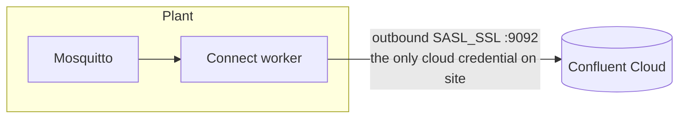

# Kafka Connect

## Why a self-managed worker

Confluent's fully managed connectors run inside Confluent Cloud. To read a broker on a
private plant network they'd need VPC peering or a tunnel *into* the plant. A worker
running next to the broker inverts that: it reaches out over one TLS connection, and
nothing reaches in.



## The worker

From `docker-compose.yml` and `connect/Dockerfile`:

| Setting | Value |
|---|---|
| Image | `confluentinc/cp-kafka-connect:7.6.0` + `confluentinc/kafka-connect-mqtt:1.7.1` |
| Mode | Distributed, group `iot-connect-cluster` |
| REST | `:8083` |
| Security | `SASL_SSL` / `PLAIN`, set for the worker, its producer and its consumer |
| Internal topics | `_iot-connect-configs`, `_iot-connect-offsets`, `_iot-connect-status`, RF 3 |

Running distributed mode with one worker looks like overkill, but it means state lives in
Kafka rather than on the container's disk — restart or replace the container and it picks
up where it left off. See [Kafka Connect internals](../concepts/kafka-connect.md).

## The deployed connector

`connectors/mqtt-source-connector.json`:

```json
--8<-- "connectors/mqtt-source-connector.json"
```

Three settings carry most of the design:

`key.converter: StringConverter`
:   The MQTT source sets the Kafka key to the MQTT topic the message arrived on —
    Confluent's docs: *"The key is the topic the message was written to."* Since each
    device has its own MQTT topic, every record from `pi-03` gets key
    `factory/line1/pi-03/parts` and goes to the same partition.

`value.converter: ByteArrayConverter`
:   Writes the message body through untouched. No schema, no envelope. This is why Flink
    sees `VARBINARY` — [Chapter 4](../story/schema.md).

*No `transforms`*
:   No timestamp transform, so the Kafka record timestamp is set when the worker
    publishes. That is `$rowtime` — [Chapter 3](../story/outage.md).

## The alternative connector (not deployed)

`connectors/mqtt-source-avro-connector.json` sketches the device-side schema route:
`AvroConverter` with Schema Registry, a `ValueToKey` transform on `device_id`, an
`InsertField` transform adding an ingestion timestamp, and a dead-letter queue.

It stays in the repo as a reference, and it would not work as written: `ValueToKey` and
`InsertField$Value` both need a structured value, and the MQTT source produces bytes.
It needs a parsing transform in front of them first.

## Other files

- `connectors/jdbc-sink-connector.json` and `postgres/init.sql` — from the earlier
  PostgreSQL + Superset design. Not used.
- `scripts/deploy_connectors.{py,ps1,sh}` — substitute `.env` values into the JSON and
  `POST`/`PUT` it to the worker's REST API.
