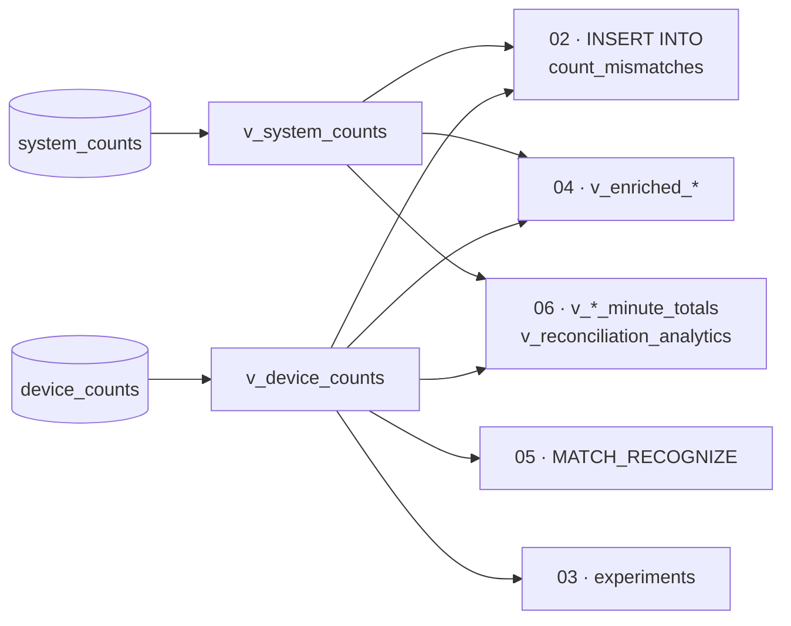

# Flink SQL, file by file

The six files in `flink_sql/` are run in order in a Confluent Cloud Flink workspace. Each
section below explains what the file does; expand **Full file** to see it exactly as it
is in the repo (it's included straight from source, so it can't go stale).



---

## 01 · Views and the output table

Two views turn raw bytes into columns, and one table defines the output contract.

```sql
$rowtime AS event_time,                                    -- ingestion time
SPLIT_INDEX(MAKE_VALID_UTF8(`val`), '::', 0) AS device_id, -- bytes → string → field
CAST(SPLIT_INDEX(MAKE_VALID_UTF8(`val`), '::', 2) AS INT) AS parts,
SPLIT_INDEX(MAKE_VALID_UTF8(`val`), '::', 4) AS ts         -- device clock, kept as a string
```

- `MAKE_VALID_UTF8` turns `VARBINARY` into a string, replacing invalid bytes rather than
  failing.
- `SPLIT_INDEX(str, '::', n)` takes the *n*-th field, zero-based.
- `CREATE TABLE count_mismatches` creates the output topic **and** registers its schema
  in Schema Registry.

??? example "Full file — `01_create_tables.sql`"

    ```sql
    --8<-- "flink_sql/01_create_tables.sql"
    ```

---

## 02 · The reconciliation

The core of the project: sum each side per device per one-minute window, join them, and
classify the difference.

```sql
FROM ( ...SUM(parts) AS device_total
       FROM TABLE(TUMBLE(TABLE v_device_counts, DESCRIPTOR(event_time), INTERVAL '1' MINUTE))
       GROUP BY device_id, line, window_start, window_end ) d
JOIN ( ...SUM(parts) AS system_total
       FROM TABLE(TUMBLE(TABLE v_system_counts, DESCRIPTOR(event_time), INTERVAL '1' MINUTE))
       GROUP BY device_id, line, window_start, window_end ) s
  ON d.device_id = s.device_id AND d.line = s.line
 AND d.window_start = s.window_start AND d.window_end = s.window_end
```

| `discrepancy` (device − MES) | `issue_type` |
|---|---|
| 0 | `NONE` |
| ≥ +15 | `BURST_RECOVERY` |
| +1 to +14 | `POSITIVE_BOUNCE` |
| −1 to −14 | `NEGATIVE_MISSED` |
| ≤ −15 | `OUTAGE_DROP` |

Things worth noticing:

- **It writes every window, including `NONE` rows.** `count_mismatches` is really a
  reconciliation log, not just a list of mismatches.
- **It's an inner join**, so a window where one side has no records produces no row.
  During an outage the device side is empty — so `OUTAGE_DROP` can't actually fire
  for a full outage. See [Chapter 3](../story/outage.md#where-did-the-deficit-go).
- Classification is by **size** only. Compare `06`, which also uses lag.
- `SET 'sql.state-ttl' = '1 HOUR'` bounds state for the statement.

??? example "Full file — `02_windowed_reconciliation.sql`"

    ```sql
    --8<-- "flink_sql/02_windowed_reconciliation.sql"
    ```

---

## 03 · Experiments

Two exploratory queries, not part of the pipeline.

**Experiment 1** shows each pulse for `pi-03` and `pi-09` beside the gap between its
device timestamp and *now* (`CURRENT_TIMESTAMP`), reading from the latest offset. This is
the per-record view where jitter *is* visible — ±25 s on `pi-09` — because nothing is
averaged.

**Experiment 2** sums `pi-03` per minute so you can watch the outage pattern from
[Chapter 3](../story/outage.md) directly: 0, 0, then 90.

The header comment records that no custom watermark exists and how to add one.

??? example "Full file — `03_watermark_experiments.sql`"

    ```sql
    --8<-- "flink_sql/03_watermark_experiments.sql"
    ```

---

## 04 · Enrichment

Adds business context to each pulse: production line name, plant zone, the
manufacturing operation, sensor type, unit value in USD and line supervisor. Then it
re-runs the reconciliation with a `FULL OUTER JOIN`, adding `financial_exposure_usd` and
a `financial_subtype`.

!!! note "It's static enrichment, not a temporal join"
    Despite the file name, the dimensions are hard-coded `CASE` expressions, not a
    lookup table joined with `FOR SYSTEM_TIME AS OF`. That's fine for ten fixed devices
    — but a real plant needs a dimension table that can change without redeploying SQL,
    and that's what a temporal join is for. See [Limits](../limitations.md).

??? example "Full file — `04_temporal_enrichment.sql`"

    ```sql
    --8<-- "flink_sql/04_temporal_enrichment.sql"
    ```

---

## 05 · Pattern detection

Three `MATCH_RECOGNIZE` patterns, each run per device in `event_time` order:

| Pattern | Definition | Catches |
|---|---|---|
| Chatter | `A B+` where every pulse has `parts > 1`, within 20 s | `pi-02` and `pi-07` bounces |
| Silent sensor | `A B` where both have `parts = 0`, within 15 s | `pi-06` missed pulses |
| Recovery flush | `BURST{10,}` — any 10+ pulses within 5 s | `pi-03` replaying its backlog |

The recovery-flush pattern works *because* of ingestion time: the 60-pulse backlog lands
in about 2.4 seconds of `$rowtime`. On device time those pulses would be spread back over
two minutes and the pattern wouldn't match. See
[MATCH_RECOGNIZE](../concepts/match-recognize.md).

??? example "Full file — `05_complex_event_processing.sql`"

    ```sql
    --8<-- "flink_sql/05_complex_event_processing.sql"
    ```

---

## 06 · Analytics views

What the dashboard is built around. Per-minute totals for each side, joined with a
`FULL OUTER JOIN`, then labelled:

| Condition | `issue_type` |
|---|---|
| device > MES **and** average lag > 10 s | `BURST_RECOVERY` |
| device > MES | `POSITIVE_BOUNCE` |
| device = 0 and MES > 0 | `NEGATIVE_MISSED` |
| device < MES | `CLOCK_JITTER` |
| otherwise | `NORMAL_SYNC` |

`avg_ingest_lag_sec` is the average of `$rowtime − ts` across the window. It's how the
view tells a replay (stale timestamps) from a bounce (fresh ones).

!!! warning "Two labels don't mean what they say"
    `CLOCK_JITTER` here really means "device below MES" — in this pipeline, that's
    almost always the MES double-counting. And `POSITIVE_BOUNCE` also catches the MES
    *dropping* a record. See
    [Chapter 5](../story/silent-faults.md#a-second-order-problem-who-gets-the-blame).

??? example "Full file — `06_streamlit_analytics_views.sql`"

    ```sql
    --8<-- "flink_sql/06_streamlit_analytics_views.sql"
    ```
