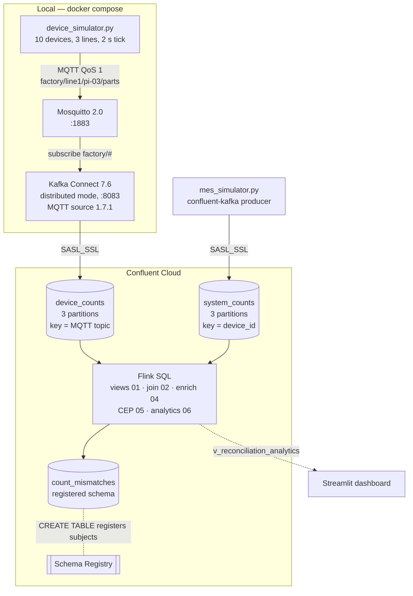

# How It Works

## End to end

## Follow one pulse

`pi-03` on line 1 makes a part at `19:35:02`.

| Step | Where | What the data looks like |
|---|---|---|
| 1 | Device | `pi-03::line1::1::RUNNING::2026-09-30T19:35:02Z`, published to MQTT topic `factory/line1/pi-03/parts` |
| 2 | Mosquitto | Held for subscribers (QoS 1: at least once) |
| 3 | Connect | MQTT source reads it. **Key** = MQTT topic (`StringConverter`). **Value** = message bytes, untouched (`ByteArrayConverter`) |
| 4 | `device_counts` | Kafka record. Its timestamp is set at publish time — this becomes `$rowtime` |
| 5 | `v_device_counts` | `val` decoded and split: `device_id`, `line`, `parts`, `status`, `ts`. `event_time` = `$rowtime` |
| 6 | `TUMBLE` | Assigned to window `[19:35, 19:36)` by `$rowtime`, summed per device |
| 7 | Join | Matched to the MES total for `pi-03` in the same window |
| 8 | `count_mismatches` | One row per device per minute with `device_total`, `system_total`, `discrepancy`, `issue_type` |

Meanwhile the MES simulator writes its own version of the same event straight to
`system_counts`, keyed by `pi-03`.

## Topics

| Topic | Producer | Key | Value | Schema |
|---|---|---|---|---|
| `device_counts` | Connect MQTT source | MQTT topic string | `::`-delimited bytes | None |
| `system_counts` | MES simulator | `device_id` | `::`-delimited bytes | None |
| `count_mismatches` | Flink `INSERT INTO` | — | Typed row | Registered by `CREATE TABLE` |
| `device_counts_dlq` | Created, unused | — | — | — |
| `_iot-connect-*` | Connect worker | — | Configs, offsets, status | Internal |

All topics are created with 3 partitions and replication factor 3 by
`scripts/create_topics.py`.

## Components

-   [**Edge devices & MQTT**](edge.md) — topology, payload, QoS, outage buffering
-   [**Kafka Connect**](connect.md) — self-managed worker, converters, keys, internal topics
-   [**Confluent Cloud topics**](confluent.md) — `$rowtime`, watermarks, Schema Registry
-   [**Flink SQL, file by file**](flink-sql.md) — every query, with what it produces
-   [**Dashboard**](dashboard.md) — tabs, data model, replay mode

