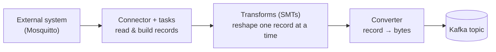

# Kafka Connect internals

## The pieces



| Piece | Job | Here |
|---|---|---|
| **Connector** | Knows how to talk to the external system; splits work into tasks | `MqttSourceConnector`, `tasks.max = 1` |
| **Task** | Does the actual reading/writing | One task subscribed to `factory/#` |
| **Transform (SMT)** | Optional per-record change — rename, add field, set key, route | None configured |
| **Converter** | Turns the record into bytes for Kafka | `StringConverter` (key), `ByteArrayConverter` (value) |
| **Worker** | The JVM process that runs all of the above | One container |

## Standalone vs distributed

| | Standalone | Distributed |
|---|---|---|
| Config | Properties file at start | REST API (`:8083`) |
| Offsets | Local file | Kafka topic |
| Scale-out / failover | No | Add workers with the same `group.id`; tasks rebalance |

This project runs **distributed mode with one worker**. There's no failover with one
worker, but state lives in Kafka — so the container is disposable.

## State lives in three topics

| Topic | Holds |
|---|---|
| `_iot-connect-configs` | Connector configurations, as submitted to the REST API |
| `_iot-connect-offsets` | Source progress — how far each source task has got |
| `_iot-connect-status` | Connector and task states: `RUNNING`, `PAUSED`, `FAILED` |

All three are compacted, so the latest value per key is kept forever.

## Delivery guarantees, end to end

This is worth being precise about, because it's easy to overclaim:

| Hop | Guarantee |
|---|---|
| Device → Mosquitto | MQTT QoS 1: at least once |
| Mosquitto → Connect | MQTT QoS 1 subscription: at least once |
| Connect → Kafka | At least once; a retry after a failure can write a duplicate |
| Kafka → Flink | Exactly once *within* Flink, via checkpoints |

**End to end, that's at-least-once.** A duplicate pulse is counted twice and shows up as
a +1. Nothing deduplicates — the payload has no unique message ID to deduplicate on.
And unlike a database CDC source, MQTT has no replayable log: the connector can't rewind
to re-read messages from an hour ago the way a CDC connector re-reads a transaction log.

## Errors

The deployed connector sets no error handling, so a bad record fails the task. The
alternative Avro config shows the usual options:

```json
"errors.tolerance": "all",
"errors.deadletterqueue.topic.name": "device_counts_dlq"
```

Note that `errors.tolerance` covers conversion and transform failures. Since
`ByteArrayConverter` accepts any bytes, there's little to fail on here — a malformed
payload arrives in Kafka fine and fails later, in the SQL — a `CAST(... AS INT)` on a
non-number can fail the statement. `TRY_CAST` returns `NULL` instead, which is the safer
choice on an unvalidated raw topic.
