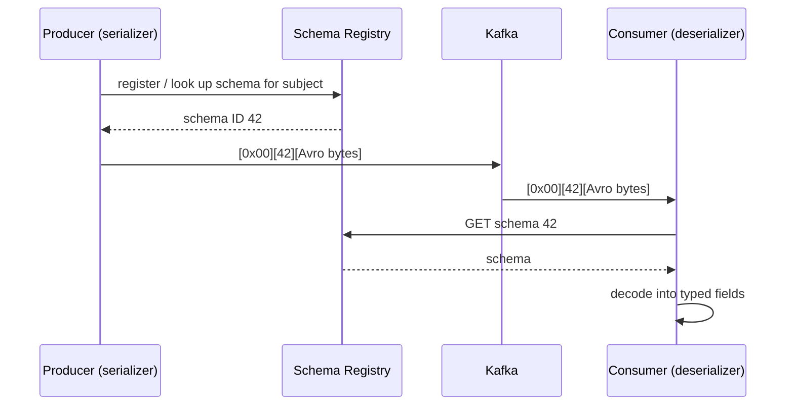

# Schema Registry & converters

## Kafka stores bytes

A Kafka record is a key and a value, and both are just bytes. Kafka doesn't know about
fields, types or JSON. Anything structured is a convention between whoever writes and
whoever reads.

## What Schema Registry adds

Schema Registry stores schemas under **subjects** (by default `<topic>-key` and
`<topic>-value`), each with numbered versions and a **compatibility rule** that controls
how a schema may change.

The serializer and the registry work together like this:

**The schema ID is inside every record.** The reader finds the schema through the
record, not through the topic. That's the fact [Chapter 4](../story/schema.md) turns on:
if the producer didn't write an ID, a subject registered for that topic does nothing.

## Compatibility, briefly

| Mode | A new schema must… | Safe upgrade order |
|---|---|---|
| `BACKWARD` (default) | be able to read data written with the previous schema | Consumers first |
| `FORWARD` | produce data the previous schema can read | Producers first |
| `FULL` | both | Either |
| `NONE` | anything goes | — |

Adding an optional field with a default is compatible both ways. Removing a required
field, or changing a type, usually isn't.

## Converters in Kafka Connect

A Connect **converter** sits between the connector's internal record and the bytes in
Kafka. It's the piece that decides whether a schema is involved.

| Converter | Writes | Schema Registry? | What Flink sees |
|---|---|---|---|
| `ByteArrayConverter` | The bytes it's given, unchanged | No | `VARBINARY` |
| `StringConverter` | A UTF-8 string | No | `VARBINARY` (raw) |
| `JsonConverter` (`schemas.enable=false`) | Plain JSON | No | `VARBINARY` (raw) |
| `AvroConverter` | `[magic][ID][Avro]` | Yes | Typed columns — *if the record had structure* |

!!! warning "A converter can only serialize the structure it's given"
    `AvroConverter` doesn't parse anything. If the connector hands it bytes — as the MQTT
    source does — it registers a *primitive* `bytes` schema and Flink gets one column.
    Structure has to be created *before* the converter, by the connector or by a
    transform.

## Where to enforce the contract

| Option | Contract at | Needs | Good when |
|---|---|---|---|
| Producer serializer | Every producer | Registry access from producers | Producers are services you own — e.g. CDC from a database |
| Connect transform + `AvroConverter` | The Connect worker | A parsing SMT (custom for delimited data) | Producers can't change, but structure is cheap to add at ingest |
| Stream processor output | `CREATE TABLE` in Flink | Nothing at the edge | Producers are devices; raw capture is acceptable (**this project**) |

!!! tip "Remember it as"
    **Put the contract where the producer can own it.** A database can own a schema; a
    sensor can't.
