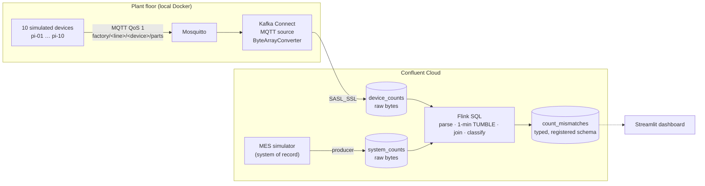

# IoT Parts Reconciliation

**Ten machines on a factory floor count the parts they make. A Manufacturing Execution
System records what was *supposed* to be made. Every minute, Flink SQL compares the two
and says where — and how — they disagree.**

This is a rebuild of an edge-to-core IoT pipeline I delivered for Delphi in 2018 on
MiNiFi, NiFi and Hortonworks. Same problem, modern stack: MQTT at the edge, a
self-managed Kafka Connect worker, Confluent Cloud, and Flink SQL.

[Read the story :material-book-open-variant:](story/index.md){ .md-button .md-button--primary }
[How it works :material-sitemap:](architecture/index.md){ .md-button }
[Live dashboard :material-chart-box:](https://iot-parts-reconciliation-anhrfruzvzhhymc9c9mcwc.streamlit.app/){ .md-button }

---

## The pipeline in one picture

## The sixty-second version

!!! abstract "If you only read one thing"
    - **Two sources of truth, compared every minute.** Edge pulses and MES records are
      both windowed into one-minute tumbling windows on the same clock and joined per
      device. The difference is classified: bounce, missed pulse, burst recovery.
    - **The edge stays dumb on purpose.** Devices send a `::`-delimited string — the
      same shape the 2018 pipeline carried. The schema is applied in Flink, and the
      output table is registered in Schema Registry automatically by `CREATE TABLE`.
    - **Windows run on Kafka ingestion time (`$rowtime`), not device time.** That one
      fact explains the most interesting behaviour in the project — a device outage shows
      up as a *burst* in the recovery minute, not as dropped late data.

## Three things this project taught me

-   :material-clock-alert-outline: **Know which clock your window runs on**

    ---

    I named a column `event_time` and assumed that made it event time. An outage test
    proved otherwise.

    [:octicons-arrow-right-24: Chapter 3](story/outage.md)

-   :material-file-code-outline: **Schema Registry is a contract, not a parser**

    ---

    I registered a schema against a raw-bytes topic and nothing changed. Here's why
    that's expected, and where the contract belongs instead.

    [:octicons-arrow-right-24: Chapter 4](story/schema.md)

-   :material-eye-off-outline: **A fault you inject isn't a fault you detect**

    ---

    Two of the simulated faults can't move a single count under ingestion time. I found
    that while writing these docs.

    [:octicons-arrow-right-24: Chapter 5](story/silent-faults.md)

## Stack

| Layer | Technology | Where it runs |
|---|---|---|
| Edge devices | Python + `paho-mqtt` simulators | Local |
| Edge broker | Eclipse Mosquitto 2.0 | Local Docker |
| Bridge | Kafka Connect 7.6 (distributed) + Confluent MQTT source 1.7.1 | Local Docker |
| Streaming platform | Confluent Cloud Kafka, Schema Registry | Azure UAE North |
| Stream processing | Confluent Cloud for Apache Flink (Flink SQL) | Confluent Cloud |
| Dashboard | Streamlit + Plotly | Streamlit Community Cloud |

!!! note "About the live dashboard"
    The hosted dashboard does not hold a Kafka consumer — keeping a cluster billing
    around the clock for a demo isn't sensible. It replays the simulators' fault
    timetable. [Chapter 6](story/dashboard.md) explains what that means and where it
    diverges from the pipeline.
