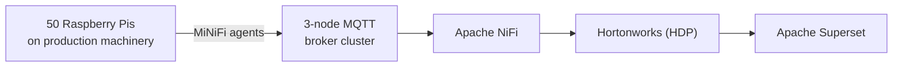

# 1 · The original, Delphi 2018

**The line to keep**
Same problem, seven years apart, on two very different stacks — which makes it a fair
comparison rather than a toy.

## The problem

In discrete manufacturing, every machine on a line counts what it produces. Separately,
the Manufacturing Execution System (MES) records what the plant believes was produced.
Those two numbers should agree. When they don't, something is wrong — a sensor
double-counting, a sensor missing parts, a network drop, a clock out of sync — and the
cost of not noticing is inventory that doesn't exist on paper, or exists on paper and not
on the shelf.

## What we built in 2018

At Wipro, after winning the Delphi proposal on a Hortonworks proof-of-concept, I built
the production version:

- **MiNiFi agents** on 50 Raspberry Pis attached to the machines, publishing part events
  over MQTT.
- **A 3-node MQTT broker cluster**, consumed by **NiFi** into the Hortonworks platform.
- **Reconciliation** of device counts against system-of-record counts in near real time.
- **Superset dashboards** covering miscounts, timing drift and dropped parts.

It held in sync during normal operation, and the validation did its job when it mattered:
it surfaced real discrepancies during plant power fluctuations.

## Why rebuild it

Not because the original failed. Because the tooling around this pattern has changed
completely, and rebuilding a problem I already understood was the most honest way to
learn the new stack:

| 2018 | 2026 |
|---|---|
| MiNiFi agents on devices | Plain MQTT clients |
| Self-run MQTT cluster | Mosquitto (single broker, local) |
| NiFi flows | Kafka Connect MQTT source |
| HDP cluster to operate | Confluent Cloud — serverless Kafka and Flink |
| Reconciliation logic in the flow | Declarative Flink SQL windows and joins |
| Superset | Streamlit |

!!! info "One thing kept deliberately the same"
    The device payload is the same `::`-delimited string the 2018 pipeline carried:
    `pi-03::line1::1::RUNNING::2026-09-30T19:35:02Z`. Holding it constant means the two
    builds differ in architecture, not in serialization. That choice comes back in
    [Chapter 4](schema.md).
