# 3 · The outage that didn't behave

<div class="takeaway" markdown>
**The line to keep**
I built an ingestion-time pipeline with an event-time column name. Naming a column
`event_time` doesn't make it one.
</div>

## The test

Factory Wi-Fi drops. When a machine loses its connection it keeps producing parts,
buffers the pulses in memory, and flushes them when the network comes back. I wanted to
see what Flink would do with that, so the device simulator has an outage mode:

```bash
# scheduled: pi-03 goes dark for minutes :35 and :36 of every hour
python simulators/dual_simulator.py

# or on demand: 70 seconds, starting 10 seconds after launch
python simulators/device_simulator.py --simulate-outage-device pi-03 --outage-duration 70
```

During the outage `pi-03` keeps generating pulses — each stamped with the device's own
clock in the `ts` field — but holds them in a list. On recovery it publishes the whole
backlog in a burst, 40 ms apart.

## What I expected

The textbook event-time story:

1. The other nine machines keep streaming, so Flink's watermark keeps advancing.
2. By the time `pi-03` reconnects, the watermark is past the windows its buffered pulses
   belong to.
3. Flink treats those pulses as late and drops them.
4. The outage minutes show a **deficit**: the MES says 30 parts, the device says fewer.

## What actually happened

The reconciliation output showed a **surplus in the recovery minute**, classified
`BURST_RECOVERY`. Nothing was dropped.

## Why

Look at how the views define time, in `01_create_tables.sql`:

```sql
CREATE OR REPLACE VIEW v_device_counts AS
SELECT
    $rowtime AS event_time,   -- ← this is the whole story
    SPLIT_INDEX(MAKE_VALID_UTF8(`val`), '::', 0) AS device_id,
    ...
    SPLIT_INDEX(MAKE_VALID_UTF8(`val`), '::', 4) AS ts   -- the device's clock, as a string
FROM device_counts;
```

`$rowtime` is, in Confluent's words, *"exactly the Kafka record timestamp."* The MQTT
source connector has no timestamp transform, so that timestamp is set **when the Connect
worker publishes the record** — not when the device made the part. The device's own
clock is sitting right there in `ts`, and nothing uses it as a time attribute.

So when `pi-03` flushes its backlog, every buffered pulse gets a *fresh* Kafka timestamp.
They aren't late. They're perfectly on-time records that happen to describe the past —
and they all land in the minute the device reconnected.

!!! warning "Widening the watermark would have done nothing"
    Confluent's default watermark is the maximum timestamp seen per partition minus a
    fixed **180 ms**. No custom watermark is declared anywhere in this project. But the
    tolerance is irrelevant here — records stamped at publish time are never late at
    *any* tolerance. The lever was never the watermark. It was the choice of clock.

## The numbers, minute by minute

At the default 2-second tick, each device produces 30 pulses a minute and the MES records
30.

```mermaid
gantt
    dateFormat  HH:mm
    axisFormat  :%M
    section pi-03 device
    30 parts           :done, 19:34, 1m
    0 — buffering      :crit, 19:35, 2m
    90 parts (30 + 60 replayed) :active, 19:37, 1m
    30 parts           :done, 19:38, 1m
    section MES
    30 / min throughout :19:34, 5m
```



| Window | Device (by `$rowtime`) | MES | Difference |
|---|---|---|---|
| :34 | 30 | 30 | 0 |
| :35 | **0** — nothing arrived | 30 | −30 |
| :36 | **0** — nothing arrived | 30 | −30 |
| :37 | **90** — 30 live + 60 replayed | 30 | **+60** |
| :38 | 30 | 30 | 0 |

The parts aren't lost; they're *misattributed*. Across the four minutes the totals
balance (−30 −30 +60 = 0).

## Where did the deficit go?

Look at the table again — minutes :35 and :36 *are* a deficit. So why did the
reconciliation output only show the surplus?

Because of the join in `02_windowed_reconciliation.sql`. It's an **inner** join between
the device-side window aggregate and the MES-side one. In minutes :35 and :36 there are
no `pi-03` records at all, so there is no device-side row to join — and an inner join
emits nothing. The outage minutes are *silent* in `count_mismatches`; only the surplus
survives.

The analytics views in `04` and `06` use a `FULL OUTER JOIN` with `COALESCE(…, 0)`, so
they *do* show minutes :35–:36 as `NEGATIVE_MISSED` and :37 as `BURST_RECOVERY`. That's
the pattern the dashboard draws.

!!! tip "Remember it as"
    **Inner join: you only see what arrived. Full outer join: you also see what didn't.**
    For reconciliation, the missing side *is* the signal — the join type has to be outer.

## The device clock wasn't wasted

The views do use `ts` — as a diagnostic rather than a clock:

```sql
AVG(TIMESTAMPDIFF(SECOND, TO_TIMESTAMP_LTZ(ts, 'yyyy-MM-dd''T''HH:mm:ss''Z'''), event_time))
    AS avg_ingest_lag_sec
```

Replayed pulses carry device timestamps 60–120 seconds old, so the recovery minute's
average lag jumps well above the 10-second threshold. That's how `06` tells a
*burst recovery* apart from a *sensor bounce*: both are surpluses, but only one has
stale timestamps.

## What I'd change

There are two ways to get real event-time semantics:

=== "Declare event time in Flink"

    Parse `ts` into a `TIMESTAMP(3)`, declare it as the time attribute with a watermark
    sized to the worst outage you're willing to wait for, and window on that.

    ```sql
    -- Confluent sets watermarks at table level
    ALTER TABLE device_counts
      MODIFY WATERMARK FOR $rowtime AS $rowtime - INTERVAL '10' SECOND;
    -- ...but for true event time, the watermark has to be on a column derived from `ts`
    ```

    The replayed pulses then fall back into minutes :35–:36 — *if* the watermark is wide
    enough to wait for them. If it isn't, they're dropped and you get the deficit I
    originally expected.

=== "Fix it at the connector"

    Add a timestamp transform on the source connector so the device's clock becomes the
    Kafka record timestamp. `$rowtime` then *is* device time and the SQL doesn't change.

    The catch: the payload is a delimited string, so a stock transform can't reach the
    `ts` field without first parsing the payload.

## The tradeoff, stated properly

| | Ingestion time (what this is) | Event time |
|---|---|---|
| Monotonic, simple | Yes | No — needs watermarks |
| Trusts device clocks | No | Yes — and they drift |
| Holds state open | No | Yes, for the watermark delay |
| Outage replay | Lands in the wrong minute | Lands in the right minute, if not too late |
| Burst detection (`MATCH_RECOGNIZE`) | Works — the replay is compressed into 2.4 s | Wouldn't fire — the replay spreads back over 2 minutes |

Neither is "correct". Ingestion time is cheaper and immune to bad device clocks;
event time attributes work correctly at the cost of state and trust. The mistake wasn't
picking ingestion time — it was picking it *without knowing I had*.
