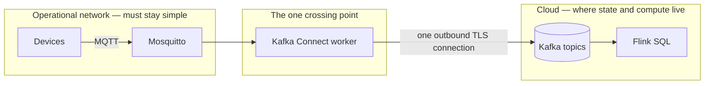

# 2 · The rebuild

**The line to keep**
Every component was chosen by where it has to *run* — a plant floor, a cloud, a public
web page — not by what it can do.

## Start from the constraints

A factory has a hard boundary between the operational network (machines, PLCs, sensors)
and everything else. Devices on that network should not hold cloud credentials, and they
should not each open their own connection to the internet. So the design question is
really: *where does the plant-floor world end, and how does data cross that line?*

## The choices, in the order I made them

**MQTT at the edge, not Kafka.** A Kafka producer keeps connections to partition leaders,
refreshes metadata and authenticates with SASL. MQTT is built for small devices on poor
networks. The devices publish to a local broker and know nothing about the cloud.

**A self-managed Connect worker, not a managed connector.** Confluent's managed
connectors run in Confluent's cloud — they can't reach a broker sitting on a private
plant network without VPC peering or a tunnel. A Connect worker running *next to* the
broker makes one outbound `SASL_SSL` connection instead. That's the only thing in the
plant that holds a Confluent credential.

**Confluent Cloud Flink SQL for the reconciliation.** The logic is "window both streams
per minute, join them per device, compare". That is a few lines of declarative SQL in
Flink, with state, windows and watermarks managed for me — no cluster to run.

**The MES publishes straight to Kafka.** It's an enterprise system, not a sensor, so it
can hold credentials. In the simulation it is a plain `confluent-kafka` producer keyed by
`device_id`.

**Streamlit instead of Superset.** I built the first version with a JDBC sink into
PostgreSQL and Superset on top. It added a database and a second container stack without
changing anything the operator sees. Shaping the output in Flink views and rendering it
directly removed both.

## What was built, in phases

| Phase | What | Where |
|---|---|---|
| Infra | Mosquitto + Connect worker in Docker, topics on Confluent Cloud | `docker-compose.yml`, `scripts/create_topics.py` |
| Ingest | MQTT source connector → `device_counts`; MES producer → `system_counts` | `connectors/`, `simulators/` |
| Parse | Views turning raw bytes into columns | `flink_sql/01_create_tables.sql` |
| Reconcile | 1-minute tumbling windows, per-device join, classification | `flink_sql/02_windowed_reconciliation.sql` |
| Test | Outage and lag experiments | `flink_sql/03_watermark_experiments.sql` |
| Enrich | Line, operation, sensor type, unit value | `flink_sql/04_temporal_enrichment.sql` |
| Patterns | Bounce, zero-count and burst detection with `MATCH_RECOGNIZE` | `flink_sql/05_complex_event_processing.sql` |
| Serve | Analytics views + Streamlit | `flink_sql/06_…`, `dashboard.py` |

The next three chapters are about what I got wrong along the way.
