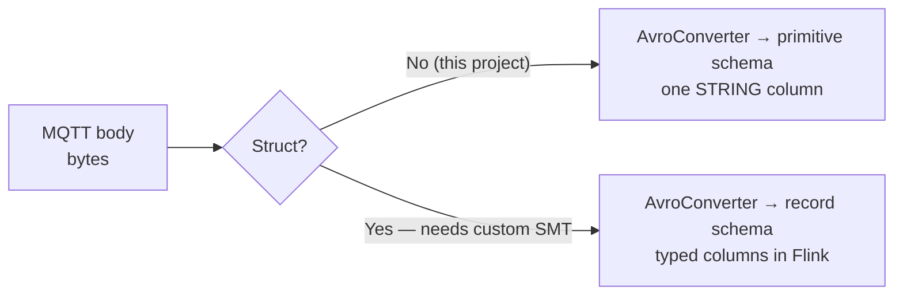

# 4 · The schema that did nothing

<div class="takeaway" markdown>
**The line to keep**
Schema Registry is a producer-side serialization contract, not a parser. The real
decision is *where* to enforce the contract, not *whether* to.
</div>

## The starting point

The raw topics arrive in Flink with no schema at all. Confluent Cloud infers the table as:

```sql
CREATE TABLE `device_counts` (
  `key` VARBINARY,
  `val` VARBINARY
) WITH ('value.format' = 'raw', ...);
```

So every view has to decode and split the bytes by hand:

```sql
SPLIT_INDEX(MAKE_VALID_UTF8(`val`), '::', 0) AS device_id,
SPLIT_INDEX(MAKE_VALID_UTF8(`val`), '::', 1) AS line,
CAST(SPLIT_INDEX(MAKE_VALID_UTF8(`val`), '::', 2) AS INT) AS parts,
```

## What I tried

I registered a schema for the `device_counts` value subject in Schema Registry,
expecting Flink to pick it up and hand me typed columns — `device_id STRING`,
`parts INT` and so on.

## What happened

Nothing. The table still showed `key` and `val` as `VARBINARY`. The SQL still had to
split strings.

## Why

Because of how Confluent's serialized formats work. A record written with the Avro
serializer looks like this on the wire:

```
┌────────────┬──────────────────┬─────────────────────────┐
│ magic byte │ schema ID        │ Avro-encoded payload    │
│   0x00     │ 4 bytes, e.g. 42 │                         │
└────────────┴──────────────────┴─────────────────────────┘
```

The *consumer* reads the schema ID from each record and asks Schema Registry for
schema 42. The schema is found **through the record**, not through the topic name.

My connector uses `ByteArrayConverter`, which writes the MQTT payload through untouched:

```
pi-03::line1::1::RUNNING::2026-09-30T19:35:02Z
```

No magic byte. No schema ID. There is nothing in the record for a deserializer to key
off, so the registered subject just sits there — nothing writes with it, nothing reads
with it.

## "Then switch to AvroConverter"

That doesn't work either, and it's worth knowing why.

`AvroConverter` serializes whatever structure the Connect record *already has*. The MQTT
source hands it the message body as a byte array — no fields, no struct. So the converter
would register a **primitive** schema (`bytes`), and Flink would give back a single
column holding the whole delimited string. You'd lose `MAKE_VALID_UTF8()` and keep every
`SPLIT_INDEX()`.

To get real fields at the connector, something has to parse the delimited string into a
Connect `Struct` *before* the converter runs. No stock transform splits a delimited
string into fields, so that's a custom Single Message Transform — Java code, deployed to
the worker.



## Where the contract went instead

The output table is declared explicitly in `01_create_tables.sql`:

```sql
CREATE TABLE `count_mismatches` (
    `window_start` TIMESTAMP(3),
    `window_end`   TIMESTAMP(3),
    `device_id`    STRING,
    `device_total` INT,
    `system_total` INT,
    `discrepancy`  INT,
    `issue_type`   STRING,
    `detected_at`  TIMESTAMP_LTZ(3)
);
```

And per Confluent's documentation, *"The CREATE TABLE statement always creates a backing
Kafka topic as well as the corresponding schema subjects for key and value in Schema
Registry."* So the reconciliation output **does** carry a registered, typed contract.
Anything downstream binds to that.

That's a medallion layout, applied to streams:

| Layer | Topics | Schema | Why |
|---|---|---|---|
| Bronze | `device_counts`, `system_counts` | None — raw bytes | Lossless capture; nothing at the edge can break ingestion by changing shape |
| Silver / gold | `count_mismatches` | Declared, typed, registered | The contract consumers actually depend on |

## Why not put Avro on the devices?

Because the Avro wire format needs the **producer** to talk to Schema Registry. On a
plant floor that means:

- Schema Registry credentials on every device,
- network egress from the operational network to a cloud service,
- device firmware coupled to schema IDs.

For machine-mounted sensors that's the wrong trade. Capture raw at the edge, enforce one
hop later.

## The cost, honestly

Parsing lives in SQL. The same `MAKE_VALID_UTF8()` + `SPLIT_INDEX()` block is repeated
across the views, there's no type safety on the raw hop, and nothing stops a device from
reordering fields. That's acceptable at the edge of a platform. It would not be
acceptable in the middle of one.

!!! tip "Remember it as"
    **The schema travels with the record, not with the topic.** If the producer didn't
    write a schema ID, a registered subject can't help you.

!!! info "The contrast that makes this click"
    At SABIC I built CDC pipelines on Avro, so each payload was validated against the
    agreed schema before it reached consumers. That works because there **the producer
    owns the contract**. Here the producer is a sensor — so it can't.
